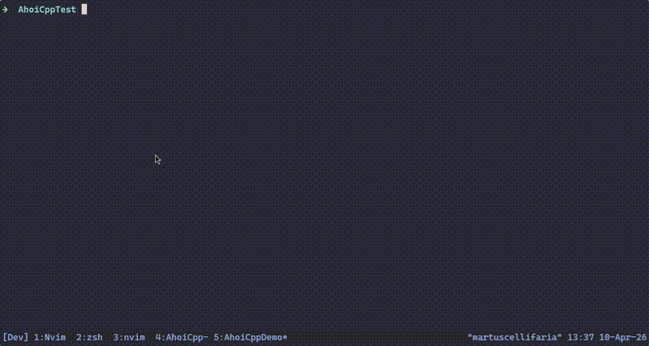
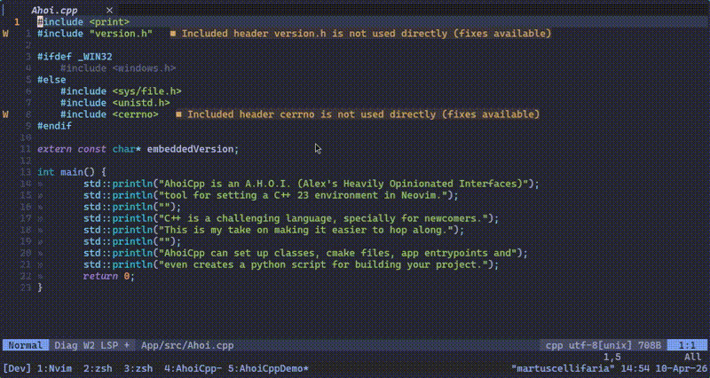
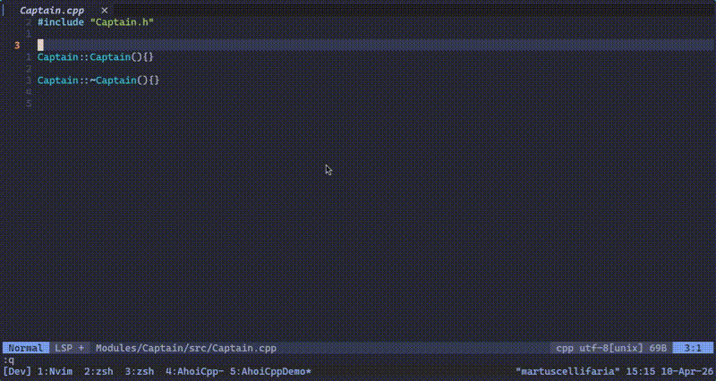

# AhoiCpp

[](https://opensource.org/licenses/MIT)
[](https://neovim.io/)
[](https://luarocks.org/modules/martuscellifaria/ahoicpp.nvim)

Ahoi Labs presents `AhoiCpp`.

AhoiCpp is a way to start cross-platform C++ projects in Neovim.
AhoiCpp lets you create classes, libraries and your own app entrypoint with the respective build process.

## Dependencies

AhoiCpp assumes you have a C++ compiler (I use g++ 14.3.0 on my development environment), `cmake`, `git` and `python` installed. If not, you should do it first.
Of course you have to have `Neovim` as well, version `0.11` or higher is recommended, since some `vim.api` and `vim.fn` functions are new.

&nbsp;

## Installation

### Using [lazy.nvim](https://github.com/folke/lazy.nvim)

```lua
{
    'martuscellifaria/ahoicpp.nvim',
    config = function()
      require('ahoicpp').setup()
    end,
}
```

### Using [Luarocks](https://luarocks.org/modules/martuscellifaria/ahoicpp.nvim)

```bash
luarocks install ahoicpp.nvim
```

After installation, you will have to add the following in your Neovim configuration:

```lua
{
      require('ahoicpp').setup()
}
```

### Manual Installation

Clone the repository and add it to your Neovim runtime path:

```bash
git clone https://github.com/martuscellifaria/ahoicpp.nvim ~/.config/nvim/pack/plugins/start/ahoicpp.nvim
```

&nbsp;

## Usage

### Default Keymaps

| Command       | Description                                                                  |
| ------------- | ---------------------------------------------------------------------------- |
| `<leader>cpa` | Creates C++ application with respective CMake files and scripts              |
| `<leader>cph` | Opens the about/help menu from AhoiCpp                                       |
| `<leader>cpm` | Creates C++ class within modules directory and add CMake files               |
| `<leader>cpd` | Creates C++ class within custom named directory and add CMake files          |
| `<leader>cpc` | Compiles the current C++ project                                             |
| `<leader>cpe` | Clones external Git repository to the externals directory of the C++ project |
| `<leader>cpt` | Toggles autocompilation at module and/or app creation (enabled by default)   |
| `<leader>cpb` | Toggles build type (release/debug)                                           |
| `<leader>cpx` | Executes the compiled binary                                                 |
| `<leader>cec` | Generates code with Escafandro                                               |
| `<leader>cee` | Get Escafandro to explain the code selected                                  |
| `<leader>cet` | Toggle Escafandro debug assist functionality                                 |

### Configuration

AhoiCpp provides a configurable interface. An example follows:

```lua
{
	autocompile_on_create = true,
	cpp_version = 23,
	enable_popups = true,
	git_init = true,
	keymaps = {
		group_c = "<leader>c",
		group_cp = "<leader>cp",
		create_app = "<leader>cpa",
		help = "<leader>cph",
		create_module = "<leader>cpm",
		create_module_dir = "<leader>cpd",
		compile = "<leader>cpc",
		clone_external = "<leader>cpe",
		toggle_autocompile = "<leader>cpt",
		toggle_debug_compilation = "<leader>cpb",
		execute_app = "<leader>cpx",
		escafandro_coding = "<leader>cec",
		escafandro_explain = "<leader>cee",
		toggle_escafandro_debug_assist = "<leader>cet",
	},
	escafandro = {
		ip = "127.0.0.1:8080",
		engine = "llamacpp",
		model = "qwen2.5-coder-7b-instruct-q4_k_m",
		max_tokens = 500,
		debug_assist = true,
	},
}
```

You are also able to override the keymap bindings or options, for example:

```lua
{
    'martuscellifaria/ahoicpp.nvim',
    config = function()
      require('ahoicpp').setup({ autocompile_on_create = false, keymaps = { compile = "<leader>cc" } })
    end,
}
```

### Escafandro coding agent

`AhoiCpp` is introducing sort of a coding agent functionality called `Escafandro`. This is still experimental and based on [TJ DeVries](https://github.com/tjdevries) presentation at Omacon 2026 idea for just in time software without having to search online.
By running `<leader>cec` you will be asked what piece of C++ code `Escafandro` should generate for you. With a few instructions, it will produce the code where your cursor was placed at the moment you run it.
`Escafandro` can also try to refactor selected code (without deleting it). This is done by running the same `<leader>cec` while having something selected in visual mode.
Other feature is producing additional debug help besides the already present `build.log` file. Interpreting C++ compiler error messages is not the most exciting experience of the daily basis, so `Escafandro` also gives some hints when something is wrong, at which file, line and so on.

`Escafandro` is targeted for local LLMs, using `llamacpp` or `ollama` as its engines, so you will have to configure a few things at the installation setup. Otherwise, `AhoiCpp` will just work as usual. 
If `Escafandro` is active

### Project structure

After running `<leader>cpa YourApp`:

```
YourApp/
├── .git/
├── .gitignore
├── AhoiCppExternals.cmake
├── AhoiCppProject.cmake
├── ahoicpp_project.json
├── build.py
├── CMakeLists.txt
├── App/
│   ├── AhoiCppSubdirs.cmake
│   ├── CMakeLists.txt
│   ├── src/
│   │   └── YourApp.cpp
│   └── version.h.in (or version.rc.in)
├── Modules/           (created when you add modules)
└── externals/         (created for Git dependencies)
    └── README.md
```

## Demo

### Creating and getting your first C++ app compiled



### Adding new classes to your project



### Adding external dependencies from git repositories



## Check Health

For health status of AhoiCpp, you can always run `:checkhealth ahoicpp` from the Neovim command line.

## Tests

### Running tests

AhoiCpp uses [plenary.nvim](https://github.com/nvim-lua/plenary.nvim) for testing. To run the tests:

    1. Ensure Plenary.nvim is installed.
    2. Navigate to the plugin directory: 
    ```bash
    cd ~/.local/share/nvim/lazy/ahoicpp.nvim
    ```
    3. Run the tests from the command line:
    ```bash
    nvim --headless -c "lua require('plenary.test_harness').test_directory('tests/spec', { minimal_init = 'tests/minimal_init.lua' })" -c "qa"
    ```

You can of course run the tests from inside Neovim. Just navigate to the directory where ahoicpp is installed, open neovim and then run:

```vim
:lua require('plenary.test_harness').test_directory('tests/spec', { minimal_init = 'tests/minimal_init.lua' })
```

For single file testing, you can use:

```vim
:lua require('plenary.test_harness').test_file('tests/spec/utils_spec.lua', { minimal_init = 'tests/minimal_init.lua' })
```

### Test tree

The tests for AhoiCpp are structured as follows:

```
tests/
├── minimal_init.lua       # Test environment setup
└── spec/
    ├── utils_spec.lua     # Filesystem and validation tests
    ├── config_spec.lua    # Configuration tests
    ├── templates_spec.lua # Template generation tests
    ├── project_spec.lua   # Project creation tests
    └── build_spec.lua     # Build system tests
```

## Troubleshooting

| Error                        | Solution                               |
| ---------------------------- | -------------------------------------- |
| "AhoiCpp is not initialized" | Run `<leader>cpa` first                |
| "Python not found"           | Install Python and ensure it's in PATH |
| Compilation fails            | Check `build/build.log`                |

## License

MIT (see [LICENSE](LICENSE) for details)
